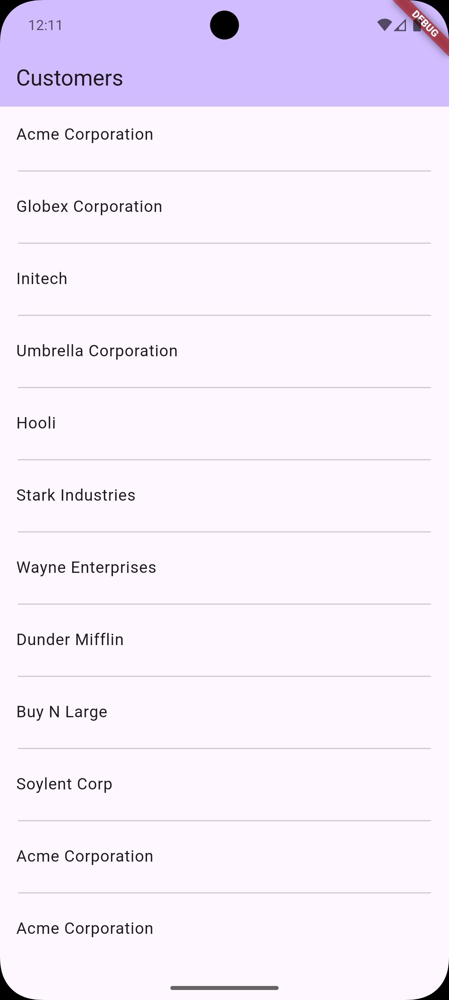
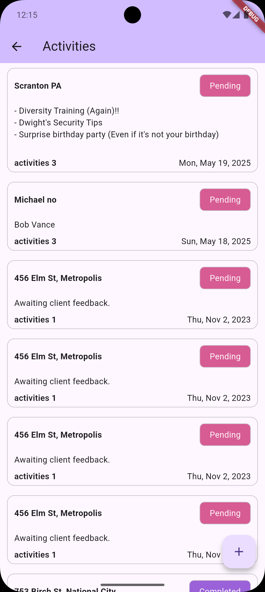
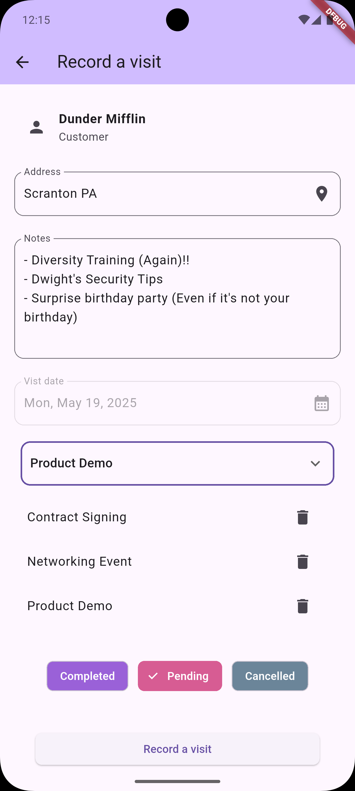

# Visits Tracker

![coverage][coverage_badge]
[![style: very good analysis][very_good_analysis_badge]][very_good_analysis_link]
[![License: MIT][license_badge]][license_link]


---

| Customers Page      |  Visits Page     | Add visits      |
|--------------------|--------------------|------------------|
|  |  |  |

---


<br>
---

shorthands using [TaskFile](https://taskfile.dev/)
```sh
* build_runner:               
* clean:                      
* gen_l10n:                   
* get:                        
* icons:                      
* l10n:                       
* release:                    
* sort:                       
* splash_screen:              
* tools:                      
* release:distribution:       
* release:staging:            
* run:dev:                    
* run:prod:                   
* run:stg:   

```

_\*Visits Tracker works on iOS, Android, Web, and Windows._


### Generating Translations

To use the latest translations changes, you will need to generate them:

Generate localizations for the current project:

```sh
flutter gen-l10n --arb-dir="lib/l10n/arb"
```

Alternatively, run `flutter run` and code generation will take place automatically.


# Setup Instructions

Follow these steps to run locally:

---

### Prerequisites
- Flutter SDK: 3.32.0  
- Dart: 3.5.3  
- Android Studio or VS Code (with Flutter plugins)  
- Git  

---

### Installation

1. **Clone the Repository**  
   ```bash
   git clone https://github.com/ggichure/visits_tracker.git
   cd visits_tracker
    ```

2. **Get Dependencies**  
   ``` sh
      flutter pub get
   ```

3. **Configure Environment**
   Create a `.env` file in the project root with:

   ``` sh
      API_KEY=
      BASE_URL=

   ```

4. **Generate Code**

   ```bash
   dart run build_runner build --delete-conflicting-outputs
   ```

5. **Run the App**

  This project contains 3 flavors:

- development
- staging
- production

To run the desired flavor either use the launch configuration in VSCode/Android Studio or use the following commands:

```sh
# Development
$ flutter run --flavor development --target lib/main_development.dart

# Staging
$ flutter run --flavor staging --target lib/main_staging.dart

# Production
$ flutter run --flavor production --target lib/main_production.dart
```

6. **Run Tests**

  
To run all unit and widget tests use the following command:

```sh
$ flutter test --coverage --test-randomize-ordering-seed random
```

To view the generated coverage report you can use [lcov](https://github.com/linux-test-project/lcov).

```sh
# Generate Coverage Report
$ genhtml coverage/lcov.info -o coverage/

# Open Coverage Report
$ open coverage/index.html
```


---


# Any assumptions, trade-offs, or limitations

- Due to time constraints, I wasn't able to work on stats.
 - Flutter has no combined date and time picker — had to use extensions.
 - Prioritized clean architecture for long-term maintainability, accepting longer initial development time over quick prototyping.


# Implementation
Flutter_bloc + get_it + injectable + retrofit 

 How They Work Together

```sh
graph TD
    UI -->|calls| Bloc
    Bloc -->|injects| Repository
    Repository -->|uses| APIClient
    APIClient -->|powered by| Retrofit
    get_it -->|resolves| Bloc & Repository
    injectable -->|generates| get_it 

```

```sh
customers/
├── data/
    ├── local/  # local db here 
│   └── remote/
│       └── customers_api_service.dart  

├── domain/
│   ├── repositories/
│   │   └── abstract_activity_repository.dart 
│   └── usecases/
│       └── activities_usecases.dart         
├── presentation/
│   └── cubits/
│       └── activities_cubit/
│           └── activities_cubit.dart         

```

 **Benefits of This Stack**
| Feature         | Benefit                                       |
| --------------- | --------------------------------------------- |
| 🧩 Modular      | Easy to test and maintain                     |
| 🧪 Testable     | Clear boundaries make unit testing a breeze   |
| ♻️ Scalable     | Ideal for growing codebases and large teams   |
| 🔧 Configurable | Swap dependencies (mock vs prod) with ease    |
| 🧠 Clean Code   | Follows SOLID principles & clean architecture |


# Notes on offline support, testing, or CI if implemented
 

   - Bloc Tests: Bloc tests were implemented. While some widget tests were added, I was not able to achieve 100% coverage due to time constraints.

   - Offline Support: Offline support can be integrated at the data layer through local data sources (e.g., using shared preferences or local databases like Hive or Drift).

  -  Continuous Integration (CI): CI was set up to cover several key areas, including spell checking, pull request validation, dependency updates via Dependabot, and running tests with coverage tracking.


[coverage_badge]: coverage_badge.svg
[flutter_localizations_link]: https://api.flutter.dev/flutter/flutter_localizations/flutter_localizations-library.html
[internationalization_link]: https://flutter.dev/docs/development/accessibility-and-localization/internationalization
[license_badge]: https://img.shields.io/badge/license-MIT-blue.svg
[license_link]: https://opensource.org/licenses/MIT
[very_good_analysis_badge]: https://img.shields.io/badge/style-very_good_analysis-B22C89.svg
[very_good_analysis_link]: https://pub.dev/packages/very_good_analysis
[very_good_cli_link]: https://github.com/VeryGoodOpenSource/very_good_cli
